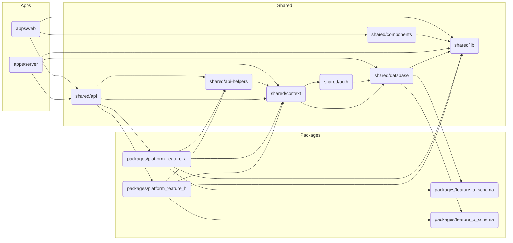

# Ignition

This is a template repository for building a web application with a backend server using Vite and React.

## Structure

The project is organized into `apps`, `shared`, and `packages` directories to promote modularity and reusability, while maintaining a clear and unidirectional dependency flow.

- **`apps/`**: Contains the primary applications.
    - `web/`: The React frontend application, powered by Vite.
    - `server/`: The Node.js backend server.
- **`shared/`**: Houses code shared across different parts of the application, particularly between the frontend and backend.
    - `lib/`: A collection of shared library code, common utilities, and helper functions.
    - `components/`: Reusable React components that can be used across different frontend parts or shared with design systems.
    - `api/`: Defines the shared API using tRPC. This module is responsible for composing the individual tRPC procedures exposed by various feature packages into a single, comprehensive API. This enables type-safe communication between frontend and backend.
    - `api-helpers/`: Contains base tRPC procedures, middleware, and configuration necessary for setting up the API layer. Feature packages extend these helpers to define their specific API endpoints.
    - `context/`: Manages common context and I/O dependencies, such as database connections and authentication services, providing essential utilities to other modules.
    - `database/`: Sets up the database, including connection configurations and SQL schema definitions.
    - `auth/`: Contains authentication-related logic, such session handling, which can be shared between the frontend and backend.
- **`packages/`**: Dedicated to encapsulating specific business logic or features as self-contained modules. These packages define their own tRPC procedures by extending from `shared/api-helpers` and interact with core services (like context and database).
    - `platform_feature_a/`: A package containing specific business logic or features for "Feature A," including its tRPC procedures.
    - `platform_feature_b/`: Another package containing business logic or features for "Feature B," including its tRPC procedures.
    - `feature_a_schema/`: Database schema definitions specific to "Feature A."
    - `feature_b_schema/`: Database schema definitions specific to "Feature B."

## Dependencies

The following outlines the dependency relationships between the different modules and packages within the project, ensuring no circular dependencies exist. The `shared/api` module acts as an orchestrator, importing and combining procedures from the feature packages, while `shared/api-helpers` provides the foundational building blocks for feature APIs.

The `shared/context` module is responsible for managing common context and I/O dependencies, such as database connections and authentication services, which are then utilized by the feature packages. The `Context` instance is passed as dependency to any required function. **We don't use global variables, state or singletons, ensuring a clean and testable architecture**.



## How to develop

Packages that are part of the setup and not business logic itself are located in the `shared` directory.
Packages that contain business logic are located in the `packages` directory.

### Adding features

To add a feature, you must first create a new package under the `packages` directory. This package should encapsulate the business logic for that feature, including its tRPC procedures, components, classes and functions.

You can create a tRPC router. To do this, you need to add the dependency `@shared/api-helpers` and create a router.

```ts
// packages/my_feature/src/index.ts

import { protectedProcedure, router } from '@shared/api-helpers'
import { schema } from '@shared/database'
import z from 'zod'

export const posts = router({
    create: protectedProcedure
        .input(
            z.object({
                title: z.string().min(1, 'Title is required'),
                content: z.string().min(1, 'Content is required'),
            })
        )
        .mutation(async ({ ctx, input }) => {
            await ctx.db.insert(schema.posts).values({
                title: input.title,
                content: input.content,
                authorId: ctx.session.user.id,
            })
        }),
})
```

Then you must import this router on the `shared/api` module, which is responsible for composing the individual tRPC procedures exposed by various feature packages into a single, comprehensive API.

```ts
// shared/api/src/server/root.ts
import { posts } from '@packages/posts'

export const appRouter = router({
    posts,
})
```

Database schemas must be added to the `shared/database` module. Schemas can be imported from other modules but they must not generate circular dependencies.

- `@packages/my_feature -> @shared/database -> @shared/my_feature_schema` -> OK
- `@packages/my_feature -> @shared/database -> @shared/my_feature` -> BAD

### Rules

**Exports**

- Packages can export backend functions, tRPC routers, classes, types, helpers, and components.
- Frontend code must be exported independently from backend code using `package.json` `exports` field.
  This is necessary to avoid exposing backend code to the frontend end and potentially causing issues at dev/build time.
- If exporting backend and client code, exports must use any of the names `client`, `services`, `server`, or `routers`.
- If using named export for client or backend, root export must not be used.
- If the code is client, backend only or shared between both, it can be exported as root export.

**Global**

- Global variables, state or singletons are not allowed.
- Use of database or any external service (redis, ai, auth provider, etc.) must be passed as a dependency to the functions that need it.
- Any added external service must be added to the `shared/context` module, which is responsible for managing common context and I/O dependencies.

## Considerations

### Names and tsconfig

All packages (under `shared`, `apps`, and `packages`) must be added as reference to `tsconfig.json` in the root of the project, so that TypeScript can resolve them correctly. For naming them we use the following convention:

- `@shared/<package_name>` for shared packages.
- `@apps/<app_name>` for applications.
- `@packages/<package_name>` for business logic packages.

If some package is meant to be published to npm, it should be placed under `packages` and follow can have any name.

### Dependencies

**Circular dependencies are not allowed.** The dependency flow should be unidirectional, meaning that a package can depend on another package, but not the other way around.

All packages that depends on other packages must have the dependencies correctly declared in their `package.json` files.
Dependencies from packages of the monorepo are declared as `workspace:*` in the `package.json` files.

If a common external dependency is used across multiple packages, for example `zod`, `react` or `drizzle-orm`, it should be declared as peer dependency in the `package.json` file of the package that uses it.
