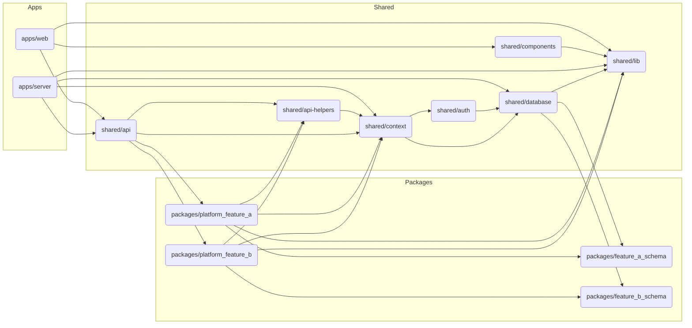

# Ignition

This is a template repository for building a web application with a backend server using Vite and React.

## Structure

The project is organized into `apps`, `shared`, and `packages` directories to promote modularity and reusability, while maintaining a clear and unidirectional dependency flow.

-   **`apps/`**: Contains the primary applications.
    -   `web/`: The React frontend application, powered by Vite.
    -   `server/`: The Node.js backend server.
-   **`shared/`**: Houses code shared across different parts of the application, particularly between the frontend and backend.
    -   `lib/`: A collection of shared library code, common utilities, and helper functions.
    -   `components/`: Reusable React components that can be used across different frontend parts or shared with design systems.
    -   `api/`: Defines the shared API using tRPC. This module is responsible for composing the individual tRPC procedures exposed by various feature packages into a single, comprehensive API. This enables type-safe communication between frontend and backend.
    -   `api-helpers/`: Contains base tRPC procedures, middleware, and configuration necessary for setting up the API layer. Feature packages extend these helpers to define their specific API endpoints.
    -   `context/`: Manages common context and I/O dependencies, such as database connections and authentication services, providing essential utilities to other modules.
    -   `database/`: Sets up the database, including connection configurations and SQL schema definitions.
    -   `auth/`: Contains authentication-related logic, such session handling, which can be shared between the frontend and backend.
-   **`packages/`**: Dedicated to encapsulating specific business logic or features as self-contained modules. These packages define their own tRPC procedures by extending from `shared/api-helpers` and interact with core services (like context and database).
    -   `platform_feature_a/`: A package containing specific business logic or features for "Feature A," including its tRPC procedures.
    -   `platform_feature_b/`: Another package containing business logic or features for "Feature B," including its tRPC procedures.
    -   `feature_a_schema/`: Database schema definitions specific to "Feature A."
    -   `feature_b_schema/`: Database schema definitions specific to "Feature B."

## Dependencies

The following outlines the dependency relationships between the different modules and packages within the project, ensuring no circular dependencies exist. The `shared/api` module acts as an orchestrator, importing and combining procedures from the feature packages, while `shared/api-helpers` provides the foundational building blocks for feature APIs.

The `shared/context` module is responsible for managing common context and I/O dependencies, such as database connections and authentication services, which are then utilized by the feature packages. The `Context` instance is passed as dependency to any required function. **We don't use global variables, state or singletons, ensuring a clean and testable architecture**.

```mermaid
graph LR
    subgraph Apps
        web(apps/web)
        server(apps/server)
    end

    subgraph Shared
        lib(shared/lib)
        components(shared/components)
        api(shared/api)
        api_helpers(shared/api-helpers)
        context(shared/context)
        database(shared/database)
        auth(shared/auth)
    end

    subgraph Packages
        feature_a(packages/platform_feature_a)
        feature_b(packages/platform_feature_b)
        feature_a_schema(packages/feature_a_schema)
        feature_b_schema(packages/feature_b_schema)
    end

    web --> lib
    web --> components
    web --> api

    components --> lib

    server --> lib
    server --> api
    server --> context
    server --> database

    api_helpers --> context

    api --> api_helpers
    api --> context
    api --> feature_a
    api --> feature_b

    auth --> database

    context --> database
    context --> auth

    database --> lib
    database --> feature_a_schema
    database --> feature_b_schema

    feature_a --> context
    feature_a --> feature_a_schema
    feature_a --> api_helpers
    feature_a --> lib

    feature_b --> context
    feature_b --> feature_b_schema
    feature_b --> api_helpers
    feature_b --> lib
```